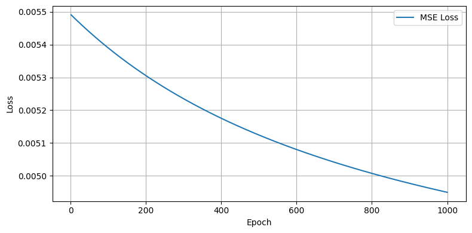
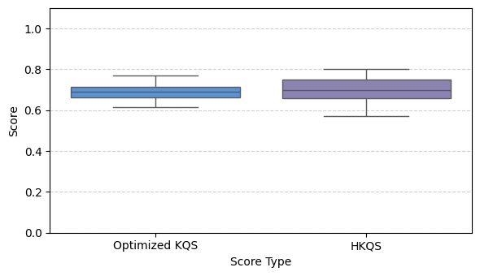
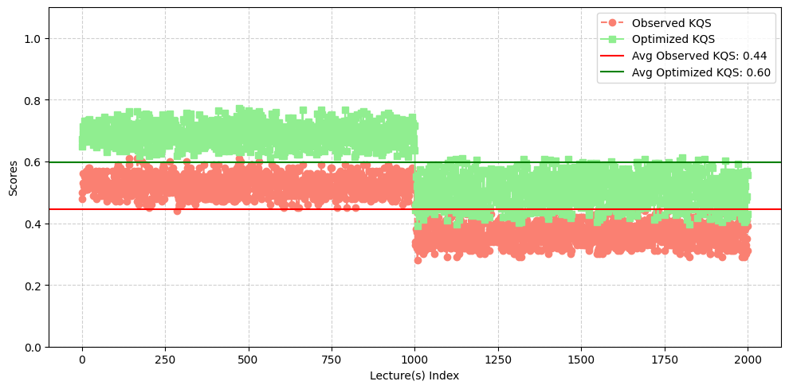
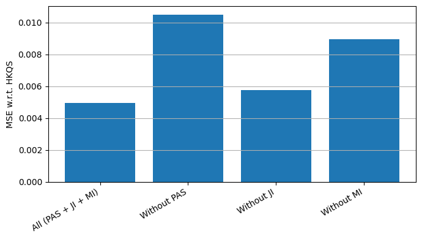
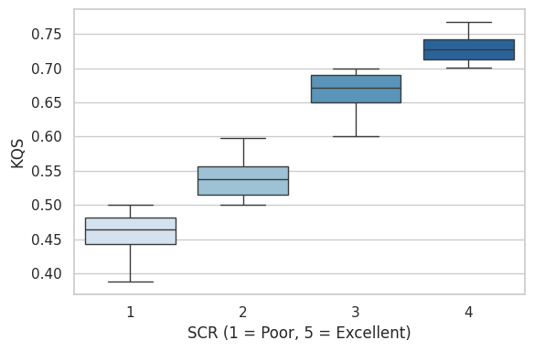
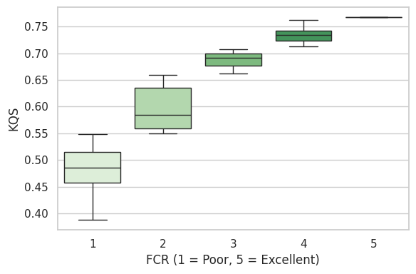

# Supplementary Figures

This directory contains supplementary figures associated with the paper:

**"LLOA: An LLM-Based Learning Analytics Framework for Lecture-Level Outcome Attainment Using Multidimensional Knowledge Quantification"**

The figures provided here support the experimental analysis, optimization process, ablation studies, and validation results reported in the manuscript.

## Contents

| File Name          | Description                                                                                        |
| ------------------ | -------------------------------------------------------------------------------------------------- |
| [`4.png`](4.png)   | Figure S(1): KQS Weight Optimization Loss Curve                                                    |
| [`6.png`](6.png)   | Figure S(2): Statistical Distribution of KQS and HKQS                                              |
| [`8.png`](8.png)   | Figure S(3): Observed KQS versus Final Optimized KQS for Detecting Changes in Lecture Content Quality |
| [`12.png`](12.png) | Figure S(4): Component Removal Ablation Study                                                        |
| [`13.png`](13.png) | Figure S(5): KQS versus Student Clarity Rating (SCR)                                              |
| [`14.png`](14.png) | Figure S(6): KQS versus Faculty Clarity Rating (FCR)                                              |

## Purpose

These supplementary figures provide additional visual evidence supporting the proposed Knowledge Quantification Score (KQS) framework, including:

* Weight optimization behavior during model calibration.
* Statistical characteristics of KQS and Human Knowledge Quantification Score (HKQS).
* Sensitivity of KQS to variations in lecture content quality.
* Impact of individual framework components through ablation analysis.
* Relationship between KQS and human evaluation metrics obtained from students and faculty members.

## Figure Preview

### Figure 4(b): KQS Weight Optimization Loss Curve ([Open Image](4.png))

### Figure 4(d): Statistical Distribution of KQS and HKQS ([Open Image](6.png))

### Figure 6: Observed KQS versus Final Optimized KQS for Detecting Changes in Lecture Content Quality ([Open Image](8.png))

### Figure 10: Component Removal Ablation Study ([Open Image](12.png))

### Figure 11(a): KQS versus Student Clarity Rating (SCR) ([Open Image](13.png))

### Figure 11(b): KQS versus Faculty Clarity Rating (FCR) ([Open Image](14.png))

## Citation

If you use or reference these supplementary materials, please cite the associated research article:

> LLOA: An LLM-Based Learning Analytics Framework for Lecture-Level Outcome Attainment Using Multidimensional Knowledge Quantification.
